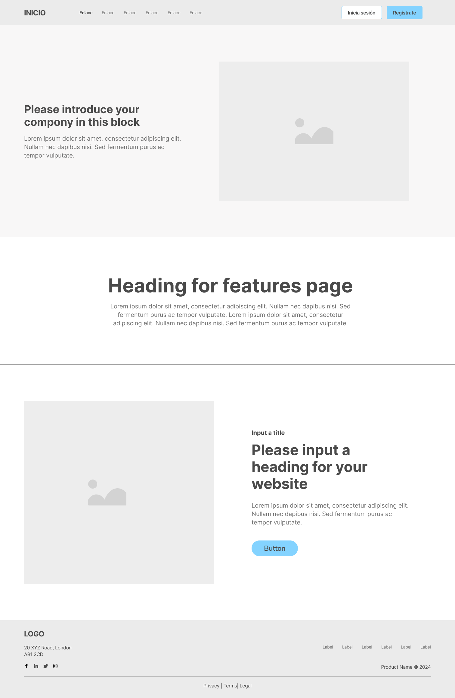

# Titulo del proyecto

Breve descripción del proyecto y su objetivo.

## Descripción del proyecto

¿Estás comenzando un proyecto pequeño, un desafío de programación o un tutorial, y necesitas una forma rápida y sencilla de crear documentación básica? ¡Esta plantilla README minimalista es para ti!

## Capturas de Pantalla del Proyecto

Incluir capturas de pantalla o imágenes que muestren el proyecto en funcionamiento.


Vista inicio de la aplicación.

## Prerrequisitos o Dependencias

Lista de software y herramientas, incluyendo versiones, que necesitas para instalar y ejecutar este proyecto:

- Sistema Operativo (por ejemplo, Ubuntu 20.04, Windows 10)
- Lenguaje de programación (por ejemplo, Python 3.8)
- Framework (por ejemplo, Django 3.1)
- Base de datos (por ejemplo, PostgreSQL 12)
- Otros...

## Instalación del Proyecto

Una guía paso a paso sobre cómo configurar el entorno de desarrollo e instalar todas las dependencias.

```bash
# paso 1
```

Y así sucesivamente...

```bash
# paso 2
```

## Instrucciones para Ejecutar el Proyecto

Instrucciones para ejecutar el proyecto una vez instalado.

```bash
#
```

## Instrucciones para Cargar la Base de Datos o Migrar los Modelos

Instrucciones necesario para cargar la base de datos o migrar los modelos de datos.

```bash
#
```

## Instrucciones para Cargar los Datos Semilla a la Base de Datos

Comandos necesario para cargar los datos semilla a la base de datos.

```bash
#
```

## Credenciales de Acceso según Tipo de Usuario luego de Cargar los Datos Semilla

### Para Usuario Tipo Administrador

- Email: administrador@mail.com
- Contraseña: Abc123#

### Para Usuario Tipo Huésped

- Email: huesped@mail.com
- Contraseña: Abc123#

## Autor

- [Brayan Diaz C](https://github.com/brayandiazc)

## Licencia 📄

Este proyecto está bajo la Licencia MIT - ve el archivo [LICENSE.md](LICENSE) para detalles

---

## Consejos Adicionales 📝

Aquí hay algunos consejos extra para aprovechar al máximo tu README:

- Mantén cada sección lo más concisa posible. Evita la pelusa innecesaria, ya que puede ser abrumadora para el lector.
- Asegúrate de que tus instrucciones de instalación, pruebas y despliegue sean detalladas y precisas. Si hay pasos adicionales que el lector necesita tomar (como instalar dependencias extra), asegúrate de incluirlos.
- Los visuales (imágenes, GIFs) son muy útiles para transmitir rápidamente lo que hace tu proyecto y cómo usarlo. Si puedes, incluye capturas de pantalla de tu aplicación en acción o GIFs que demuestren su uso.
- El tono amigable y acogedor que usas en tu README es excelente. Ayuda a hacer tu proyecto más acogedor para los colaboradores.

Recuerda, un buen README es crucial para hacer que tu proyecto sea atractivo y accesible para otros desarrolladores. ¡Buena suerte con tu proyecto!

---

⌨️ con ❤️ por [Brayan Diaz C](https://github.com/brayandiazc) 😊
